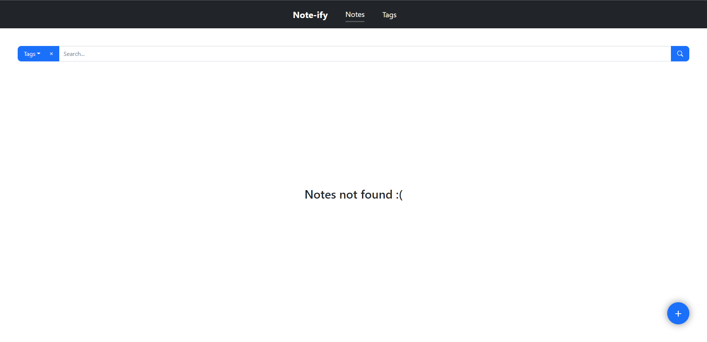
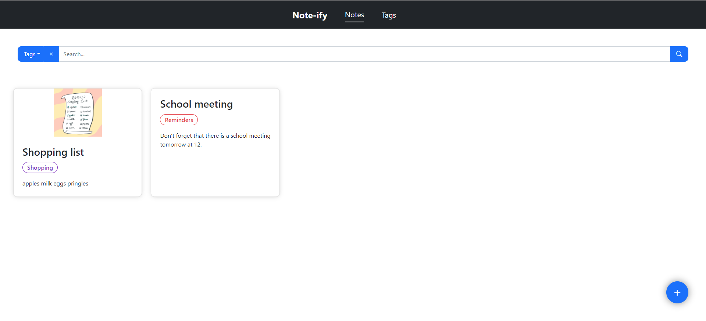
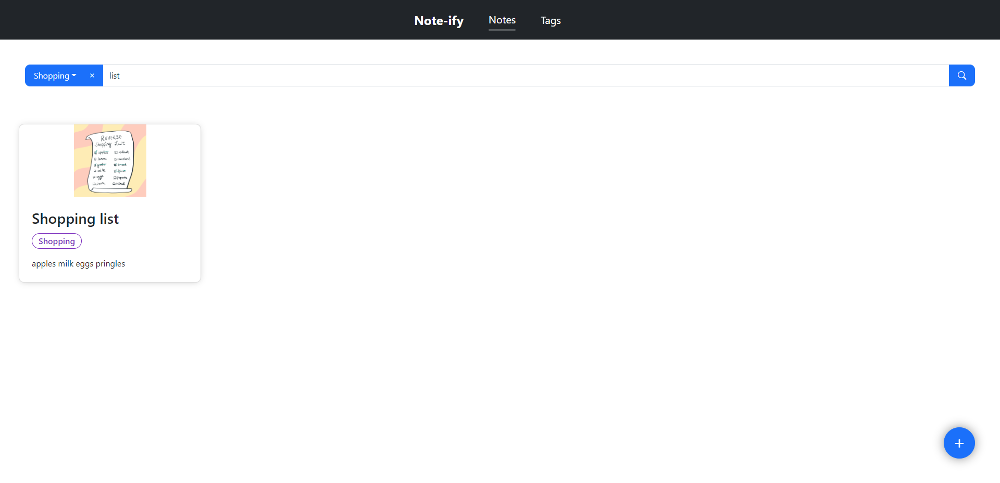
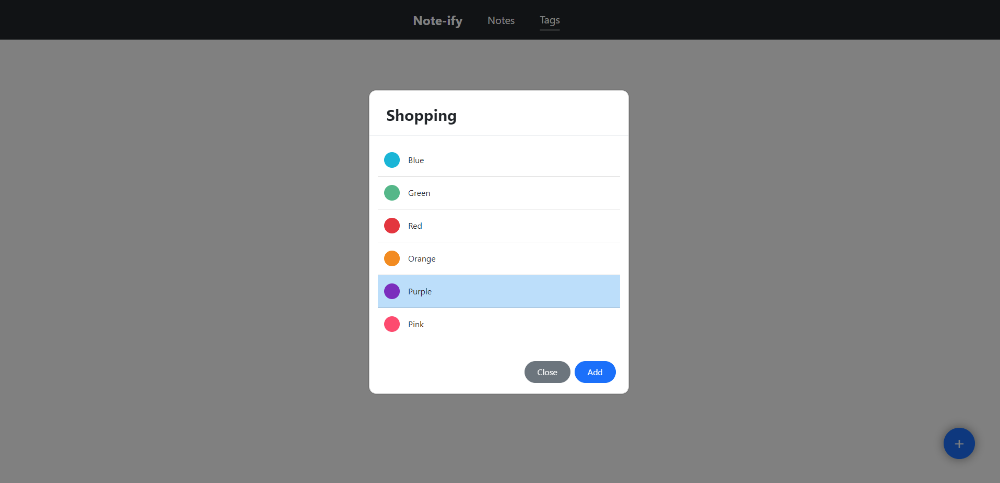
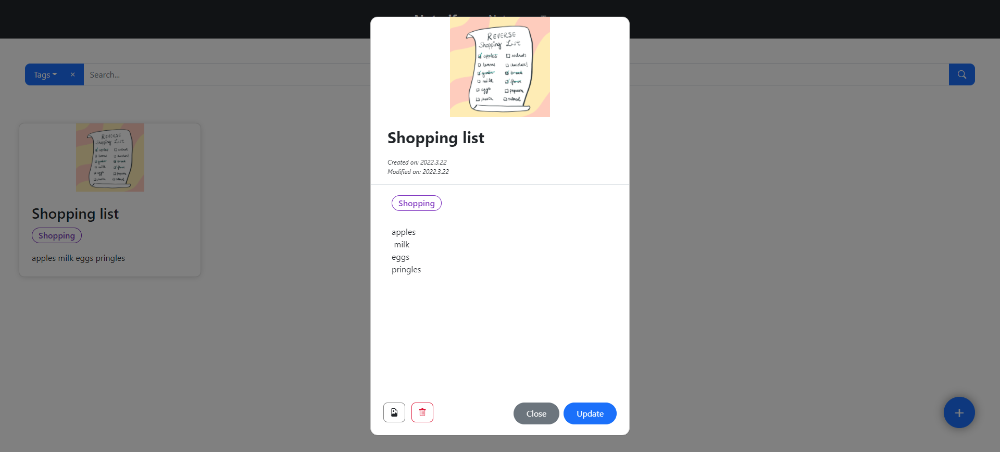

# Note-ify

---

This is a short presentation of the Note-ify web app.
 
Note-ify can be used on every device no matter of screen size.
 
Note-ify is a web app made in Angular and it's using the Notes API which can be found in another repository.
 
Below there is a short presentation of the app.

<b>Empty notes list</b>
 

 
 
 
 
 
 

<b>Notes list</b>

 
 
 
 
 
 

<b>Filtered notes list.  The notes can be filtered by tag, title or description.</b>

 
 
 
 
 
 

<b>Add tag pop-up.  Each tag has a color and a title. This particular tag is used in the Shopping list note.  Each tag can be edited once they are added.</b>

 
 
 
 
 
 

<b>Here's the edit note dialog.   Each note has a title, description, tag, creation date, modified date (last date when the note was modified) and an image.  When you update the note, you can change the tag and the image as well.  The note can be removed using the red button with the trash icon.</b>
 

